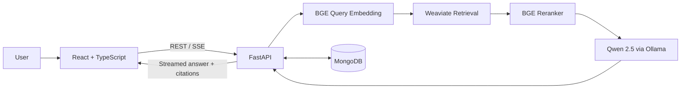

# CIS Controls v8 Local RAG Assistant

A fully local Retrieval-Augmented Generation (RAG) application that answers cybersecurity questions using only the **CIS Controls v8** document.

The system combines document parsing, meaningful chunking, local embeddings, hybrid vector retrieval, reranking, local Qwen generation, citations, MongoDB persistence, and a professional React chat interface.

> Unsupported questions are answered with the exact refusal:
>
> `The retrieved documents do not contain enough information to answer this question.`

## What was shipped

- Complete local RAG pipeline covering all 18 CIS Controls
- Approximately 155 structured chunks with page, control, title, source, and chunk metadata
- `BAAI/bge-small-en-v1.5` embeddings
- Weaviate hybrid retrieval (around 20 candidates)
- `BAAI/bge-reranker-v2-m3` reranking (best 5 chunks)
- Local `qwen2.5:3b` generation through Ollama
- FastAPI REST and Server-Sent Events (SSE) integration
- React + TypeScript professional chat interface
- Inline citations, hover previews, and source metadata
- MongoDB conversations, messages, response versions, and feedback
- Regeneration, version switching, thumbs up/down, stop, copy, delete, and resume
- First-time guided tour with a replay option

## Architecture



## Technology stack

| Area | Technologies |
|---|---|
| Document processing | Unstructured `hi_res`, Poppler, Tesseract |
| Embeddings | `BAAI/bge-small-en-v1.5` |
| Vector search | Weaviate |
| Reranking | `BAAI/bge-reranker-v2-m3` |
| Local LLM | Ollama `qwen2.5:3b` |
| Backend | Python 3.12+, FastAPI, Pydantic, SSE |
| Persistence | MongoDB 8 |
| Frontend | React, TypeScript, Vite, Tailwind CSS, shadcn/ui |
| Infrastructure | Docker Compose |

## Quick start

Detailed setup is available in [`rag_setup/README.md`](rag_setup/README.md).

### Prerequisites

Install Python 3.12+, `uv`, Node.js 20+, Docker Desktop, and Ollama.

### Start the stack

```powershell
# Clone
git clone https://github.com/fatimazeort/dar-internship-2026.git
cd dar-internship-2026\rag_setup

# Local configuration
Copy-Item .env.example .env
# Edit .env and replace the placeholder MongoDB credentials.

# Databases
docker compose up -d

# Local LLM
ollama pull qwen2.5:3b

# Backend dependencies
uv sync

# First run only: create/recreate the Weaviate collection
uv run python vector_store.py

# Start FastAPI
uv run uvicorn api:app --reload --host 127.0.0.1 --port 8000
```

In a second terminal:

```powershell
cd dar-internship-2026\rag_setup\frontend
Copy-Item .env.example .env
npm install
npm run dev
```

Open `http://localhost:5173`.

> After the one-time prerequisites, model downloads, and vector ingestion are complete, the application can be started in under five minutes. A completely fresh machine may take longer during the initial model downloads and PDF ingestion.

## Main API endpoints

| Method | Endpoint | Purpose |
|---|---|---|
| GET | `/health` | Check API, Weaviate, MongoDB, Ollama, and model status |
| POST | `/ask` | Generate a non-streaming grounded answer |
| POST | `/ask/stream` | Stream and persist a grounded answer |
| GET | `/conversations` | List saved conversations |
| GET | `/conversations/{id}` | Resume a conversation |
| DELETE | `/conversations/{id}` | Delete a conversation and related data |
| POST | `/messages/{id}/regenerate/stream` | Generate a new answer version |
| GET | `/messages/{id}/versions` | List response versions |
| POST | `/messages/{id}/versions/{n}/activate` | Activate a saved version |
| GET/PUT | `/messages/{id}/versions/{n}/feedback` | Load or save version feedback |

## Documentation

- [Full setup and technical guide](rag_setup/README.md)
- [AI tooling usage and impact](AI_TOOLING.md)
- [AI coding customization artifact](.github/copilot-instructions.md)

## Git workflow

Development is performed on feature branches. The final frontend and persistence work is on:

`feature/frontend-chat-streaming`

The project should be reviewed through a pull request against `main`; it should not be merged directly during internship review.
